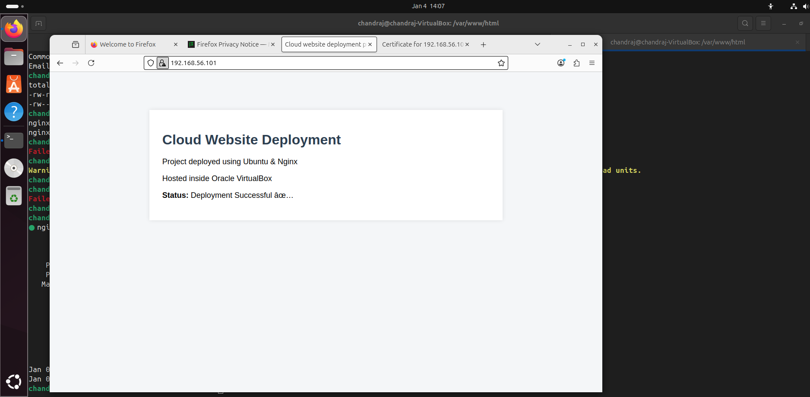
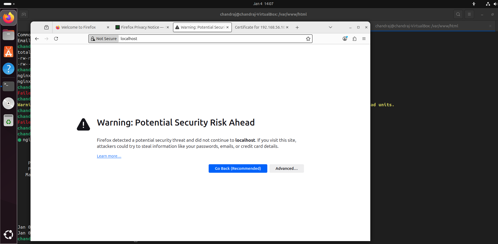
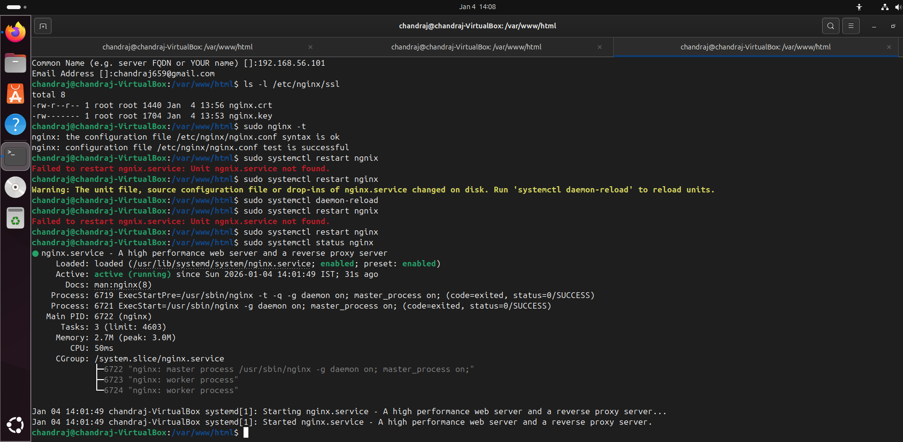

# Cloud Website Deployment

Deployed a static website using **Nginx** on an **Ubuntu Virtual Machine** (VirtualBox).

## Tech Stack
- Ubuntu Linux
- Nginx Web Server
- VirtualBox
- HTML / CSS

## What I Did
- Created an Ubuntu VM using VirtualBox
- Installed and configured Nginx
- Deployed a static website in `/var/www/html`
- Verified deployment via browser and system services

## Deployment Proof

### Nginx Service Running

### Website Deployed on Ubuntu VM

### Terminal Verification

